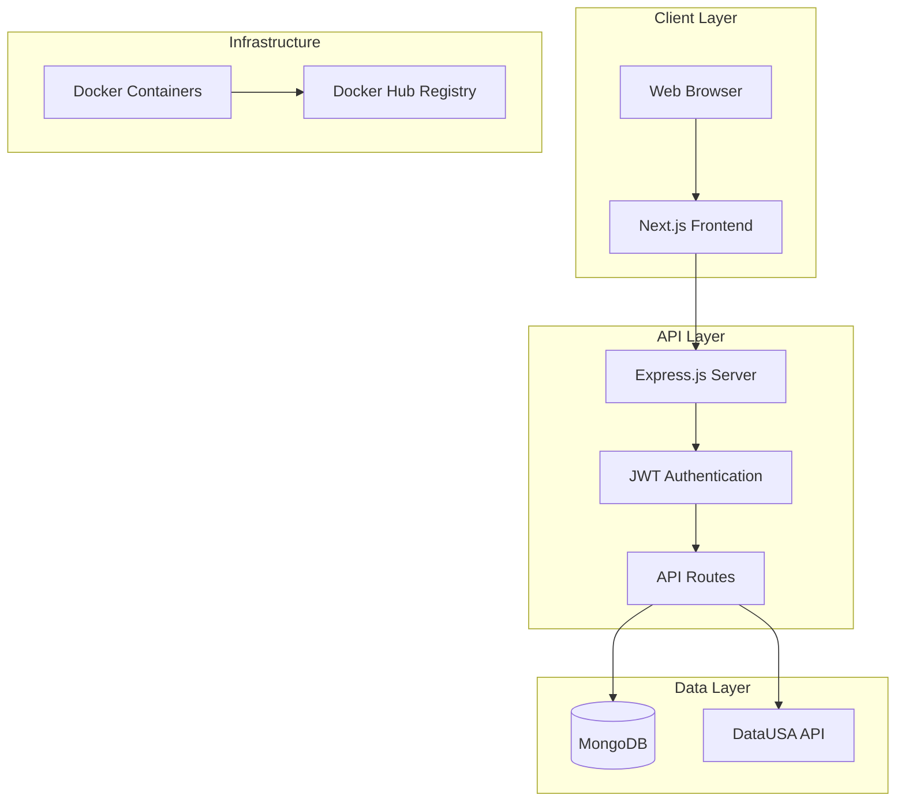
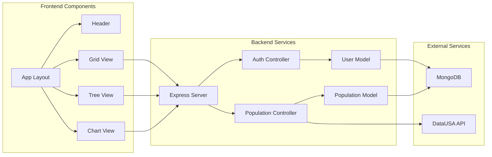
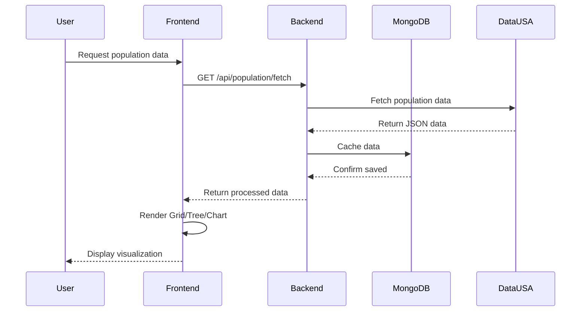
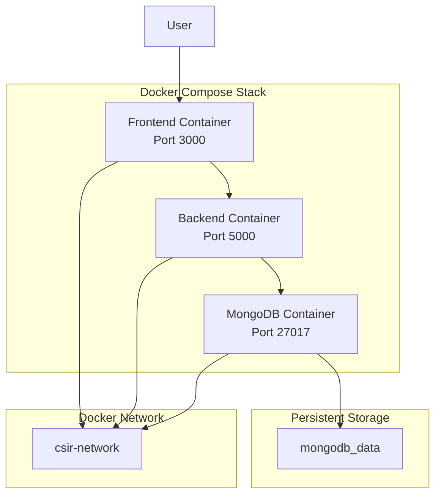

# EIO1 - Architecture Documentation

## CSIR EOI 8119 - Population Data Visualization

### System Architecture

### Component Diagram

### Data Flow Sequence

### Technology Stack

| Layer    | Technology   | Purpose          |
| -------- | ------------ | ---------------- |
| Frontend | Next.js 14   | React framework  |
| Frontend | React 18     | UI library       |
| Frontend | TypeScript   | Type safety      |
| Frontend | Tailwind CSS | Styling          |
| Backend  | Node.js      | Runtime          |
| Backend  | Express.js   | Web framework    |
| Backend  | Mongoose     | ODM              |
| Database | MongoDB 7    | NoSQL database   |
| Auth     | JWT          | Authentication   |
| DevOps   | Docker       | Containerization |

### Deployment Architecture

